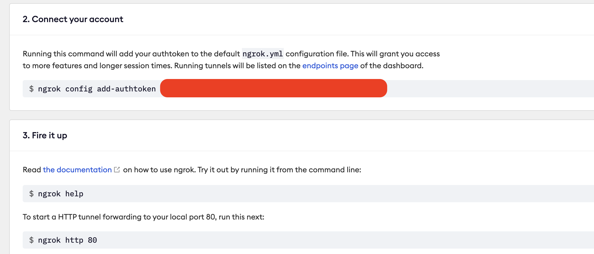
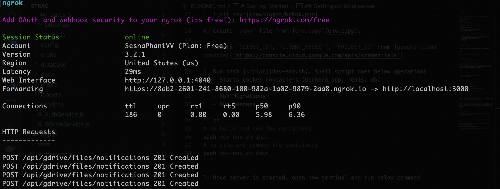

# Introduction

GDrive Apis Nodejs Application

- Author: Venkata Sesha Phani
- Email: phani.vakicherla@gmail.com

# Getting Started

Follow the below instructions to get started with this project.

## Software Dependencies

- Node.js v16
- Docker
- [Ngrok](https://ngrok.com/)

## Setting up local server

1. Install `Ngrok` from the [website](https://ngrok.com/).

2. Signup and create an account.

3. Follow the steps given in the Ngrok website.
   

4. Create `.env` file from [env.copy](env.copy).

5. Update `CLIENT_ID`, `CLIENT_SECRET`, `PROJECT_ID` & `NGROK_SERVER_ADDR` from [google cloud console](`https://console.cloud.google.com/apis/credentials`)

6. Run bash [script](dev-env.sh). Shell script does below operations
   - Starts docker containers (backend_app, redis, db)
   - Starts Nodejs server at port 3000
   - Run Migrations
   - Run Seeders

```sh
# to build and run the containers
bash dev-env.sh init
# to stop and remove the containers
bash dev-env.sh down
```

7. Once server is started, open new terminal and run below command

```sh
# localhost tunneling
ngrok http 3000
```

8. Update the `NGROK_SERVER_ADDR` env variable by getting the https address from the output of previous command.
   

## Implementation Details

### Total 7 APIs has been built and can be used.

1. Get `{{host}}/api/gdrive/authenticate` -> generates authUrl and redirects to the callback url specified
2. Get `{{host}}/api/gdrive/auth/callback` -> generates new access token and stores in db `access_tokens` table.
3. Get `{{host}}/api/gdrive/files` -> gets access_token from db and gets all the files from google drive. Per call files are limited to 100. Total Files limited to 1000. Response will be like below:

```json
[
  {
    "id": "14DL_1YalFgYhVEuiPCzjDGOgu5kVzkkTg",
    "name": "Test-file-1"
  },
  {
    "id": "1FBmoaYxmJ4w0lfQ0msSCE4NZBdiiP7fDW0",
    "name": "Test-file-2"
  }
]
```

4. Get `{{host}}/api/gdrive/files/:file_id` -> Lists permissions of given file along with mimeType and name.

```json
{
  "about": {
    "id": "1FBmoaYxmJ4w0lfQ0msSCE4NZBd",
    "name": "Test-file-1",
    "mimeType": "application/vnd.google-apps.document"
  },
  "permissions": [
    {
      "emailAddress": "phani.vakicherla@gmail.com",
      "role": "owner"
    }
  ]
}
```

5. POST `{{host}}/api/gdrive/files/download/:file_id` -> Downloads the file into the downloads folder inside the code base.

Limitation: Currently blob type of files are downloading fine. Google Workspace documents are not being exported properly.

6. POST `{{host}}/api/gdrive/files/watcher/:file_id` -> Adds Watcher to the file id to track any changes. API 7 is added as a callback notification for this api. The https address is **ngrok address** which tunnels traffic to local server.

```json
{
  "kind": "api#channel",
  "id": "some_id",
  "resourceId": "some_id",
  "type": "web_hook",
  "address": "https://8ab2-2601-241-8680-100-982a-1a02-9879-2aa8.ngrok.io/api/gdrive/files/notifications",
  "payload": true
}
```

TODO: Store the channel ids and implement stop watch functionality.

7. POST `{{host}}/api/gdrive/files/notifications` -> Webhook Callback URL.
   Whenever any watched resource changes, google calls this ngrok url and we can track the changes.

## Error codes:

1. Error Code 401

```json
{
  "message": "Invalid Credentials",
  "statusCode": 401
}
```

This error means that access token is expired and you need to authenticate again. Please call authenticate api [API 1](#total-7-APIs-has-been-built-and-can-be-used.) from the browser.


## Postman Collection:

[Postman Collection](downloads/GDrive-Strac.postman_collection.json)


**References**:
https://console.cloud.google.com/apis/library/drive.googleapis.com

https://developers.google.com/drive/api/guides/ref-export-formats

https://developers.google.com/drive/api/v3/reference/changes/watch

https://developers.google.com/drive/api/guides/about-files#types

https://github.com/googleapis/google-api-nodejs-client/tree/main/samples/drive
